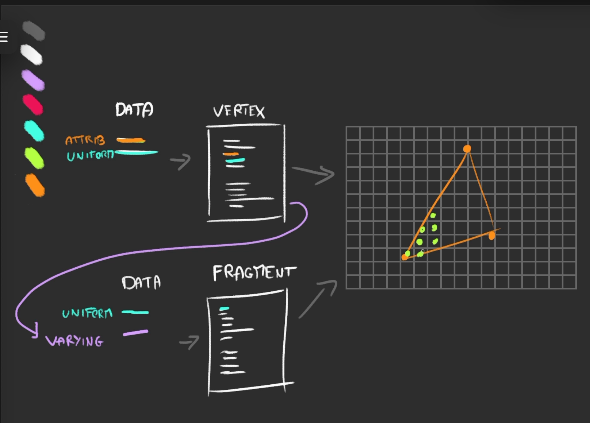

# webgl and HTML

1. Vertex Shaders

   a. manipulate the postion vec3 to have different geometries

   b. use perlin noise to manipulate postion, [reference implementation](https://gist.github.com/patriciogonzalezvivo/670c22f3966e662d2f83) in glsl here

   c. use `sin` or other function to generate curv shaped geometries

   d. `uniforms`: how to introduce concept of time in vertext shaders:

   - define uniforms while defining the shader material
   - use the uniform variable in vertex shader
   - update the uniform value in request animation frame

## Features to implement

1. Smooth Scrolling
2. Merging with HTML
3. https://www.youtube.com/watch?v=ivg603bYDk8
4. https://www.youtube.com/watch?v=DdQn82X1G3I&t=1438s
